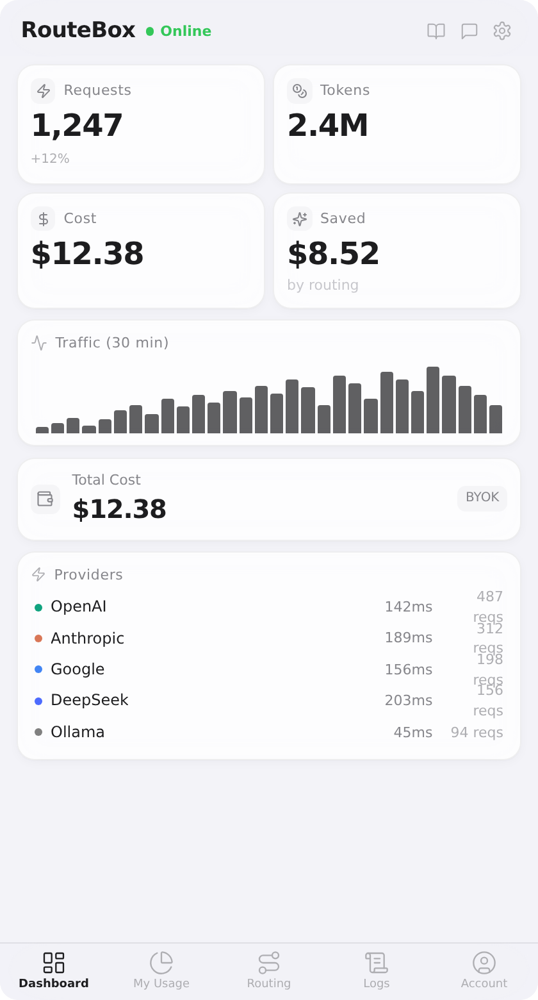
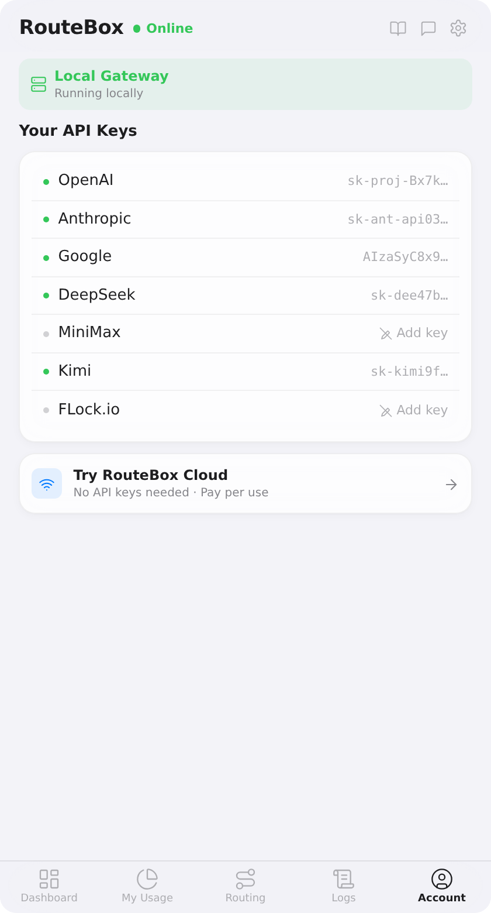
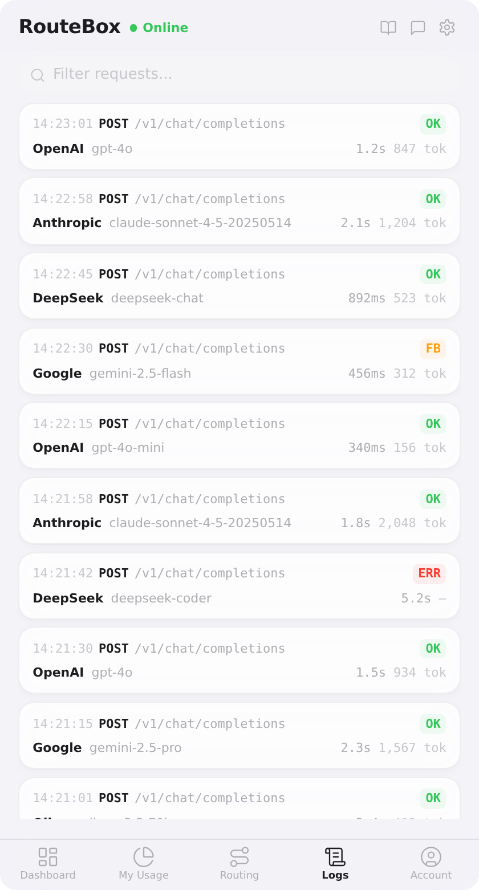
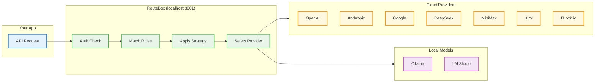

<p align="center">
  
</p>

<h1 align="center">RouteBox</h1>

<p align="center">
  <em>One proxy. Every model. Your rules.</em><br/>
  A macOS menu bar app that routes your LLM API calls to the best provider — by cost, speed, or quality.
</p>

<p align="center">
  <a href="#"></a>
  <a href="#"></a>
  <a href="#"></a>
  <a href="#"></a>
</p>

<!-- Screenshots -->
<p align="center">
  
  &nbsp;&nbsp;
  
  &nbsp;&nbsp;
  
</p>

<p align="center">
  <a href="https://github.com/createpjf/RouteBox/releases/latest">
    
  </a>
</p>

<p align="center">
  <a href="#quickstart">Quickstart</a> •
  <a href="#why-i-built-routebox">Why I built RouteBox</a> •
  <a href="#features">Features</a> •
  <a href="#how-it-works">How it works</a> •
  <a href="#supported-providers">Providers</a> •
  <a href="#installation">Installation</a> •
  <a href="#contributing">Contributing</a>
</p>

---

## What is RouteBox?

RouteBox is a **native macOS menu bar app** that runs a local OpenAI-compatible proxy on `localhost:3001`. Point any app at it instead of directly at OpenAI / Anthropic / Google — RouteBox picks the best provider for each request based on your rules, tracks cost and latency in real-time, and supports both cloud APIs and local models (Ollama / LM Studio).

```
Your App  →  RouteBox (localhost:3001)  →  Cloud: OpenAI / Anthropic / Google / DeepSeek / MiniMax / Kimi / FLock.io
                                         →  Local: Ollama / LM Studio
```

## Why I built RouteBox

I work across multiple AI providers every day — testing models, switching keys, comparing outputs. What started as a simple annoyance (manually swapping `base_url` and `api_key` in every script) became a real productivity tax. I was losing track of which provider I was hitting, how much I was spending, and whether a cheaper model could've handled the same task.

RouteBox started as a personal tool: a lightweight local proxy that sits in the menu bar and handles the routing for me. I wanted something that respects the way macOS apps should feel — quiet, native, always available but never in the way. One endpoint for everything, with full visibility into what's happening under the hood.

It's MIT licensed and open source because I think developer tools should be transparent and hackable.

---

## Features

- **Intelligent routing** — auto-route requests by cost, speed, or quality.
- **Content-aware rules** — detect code tasks, long context, or custom patterns and route accordingly.
- **Real-time dashboard** — track requests, tokens, cost, and savings at a glance.
- **Cloud + Local** — 7 cloud providers + local models via Ollama and LM Studio.
- **Full request logs** — every call logged with model, provider, latency, and token count.
- **Usage analytics** — cost trends, latency comparison, model usage breakdown.
- **Budget alerts** — set monthly limits with warnings at 80% and 100%.
- **Native UX** — Tauri v2 + React, frosted glass, SF Pro, feels like a macOS system tool.
- **Docker gateway** — run the proxy headless for server or team use.

### Coming soon

- **RouteBox Cloud** — pay-as-you-go API access with credits. No need to configure multiple API keys — just top up and go.
- **Provider health monitoring** — auto-detect latency spikes, rate limits, and downtime with automatic fallback.
- **More platforms** — Windows, Linux, and iOS/Android support.

---

## How it works

### Routing Flow



### Routing Strategies

| Strategy | Behavior |
| --- | --- |
| **Smart Auto** | AI picks the best route per request based on content analysis |
| **Cost First** | Always pick the cheapest available provider |
| **Speed First** | Always pick the lowest-latency provider |
| **Quality First** | Always pick the best available model tier |

### Content-Aware Rules

| Rule Type | Triggers when... | Example |
| --- | --- | --- |
| **Alias** | Model name matches a virtual name you define | `route-code` → `deepseek-coder` |
| **Code** | Request contains ≥3 code markers | Auto-route code tasks to DeepSeek |
| **Long** | Message ≥8,000 characters | Auto-route long context to Gemini |
| **General** | Catch-all fallback | Default model for everything else |

### Model Preferences

- **Pin**: Force `gpt-4o` → always use OpenAI (never fall back).
- **Exclude**: Never route `gpt-4o` through provider X.

---

## Supported Providers

### Cloud

| Provider | Models | API Key |
| --- | --- | --- |
| [OpenAI](https://openai.com) | GPT-5.2, GPT-5 | [platform.openai.com](https://platform.openai.com/api-keys) |
| [Anthropic](https://anthropic.com) | Claude Opus 4.6, Claude Sonnet 4.6, Claude Haiku 4.5 | [console.anthropic.com](https://console.anthropic.com/) |
| [Google](https://ai.google.dev) | Gemini 3.1 Pro, Gemini 3.1 Flash | [aistudio.google.com](https://aistudio.google.com/apikey) |
| [DeepSeek](https://deepseek.com) | DeepSeek-V3.2, DeepSeek-R1 | [platform.deepseek.com](https://platform.deepseek.com/) |
| [MiniMax](https://minimax.io) | MiniMax-M2.5, MiniMax-M2.1 | [platform.minimaxi.com](https://platform.minimaxi.com/) |
| [Kimi](https://kimi.ai) | Kimi K2.5, Kimi K2, Moonshot | [platform.moonshot.ai](https://platform.moonshot.ai/) |
| [FLock.io](https://flock.io) | Qwen3-235B, Qwen3-30B, DeepSeek-V3.2, Kimi K2.5 | [platform.flock.io](https://platform.flock.io) |

### Local

| Provider | Setup |
| --- | --- |
| [Ollama](https://ollama.com) | Install Ollama and pull any model — RouteBox auto-detects it |
| [LM Studio](https://lmstudio.ai) | Run LM Studio's local server — RouteBox connects automatically |

> **Tip:** [FLock API Platform](https://platform.flock.io) provides access to open-source models at competitive rates — a good option for cost-effective routing.

---

## Quickstart

### Download (recommended)

1. Grab the latest `RouteBox.dmg` from [**Releases**](https://github.com/createpjf/RouteBox/releases/latest).
2. Drag **RouteBox** into **Applications** and launch it.
3. The app appears in your menu bar. Press `⌘⇧R` to toggle the panel.
4. Go to **Settings → Providers** and add your API keys.
5. Point any OpenAI-compatible client at `http://localhost:3001/v1`:

```python
from openai import OpenAI

client = OpenAI(
    base_url="http://localhost:3001/v1",
    api_key="YOUR_ROUTEBOX_TOKEN"  # shown in Settings → Authentication
)

response = client.chat.completions.create(
    model="gpt-4o",
    messages=[{"role": "user", "content": "Hello!"}]
)
```

That's it. RouteBox handles the rest.

---

## Installation

### From Releases (recommended)

1. Download `RouteBox.dmg` from [**Releases**](https://github.com/createpjf/RouteBox/releases/latest).
2. Drag **RouteBox** into **Applications**.
3. Launch and start adding provider keys.

### From Source

**Prerequisites:** macOS 12+, [Node.js](https://nodejs.org) 20+, [pnpm](https://pnpm.io) 10+, [Bun](https://bun.sh) 1.x, [Rust](https://rustup.rs) (stable), Xcode CLT (`xcode-select --install`).

```bash
git clone https://github.com/createpjf/RouteBox.git
cd RouteBox
pnpm install
cd apps/desktop
pnpm tauri dev
```

### Docker (Gateway Only)

Run the routing gateway headless — no macOS desktop UI, ideal for servers or team use:

```bash
cd apps/gateway
docker build -t routebox-gateway .
docker run -p 3001:3001 \
  -e OPENAI_API_KEY=sk-... \
  -e ANTHROPIC_API_KEY=sk-ant-... \
  -v routebox-data:/data \
  routebox-gateway
```

See [`apps/gateway/.env.example`](apps/gateway/.env.example) for all environment variables.

### Build DMG

```bash
cd apps/desktop
pnpm tauri build

# With updater signing
TAURI_SIGNING_PRIVATE_KEY="$(cat src-tauri/routebox-signer.key)" \
TAURI_SIGNING_PRIVATE_KEY_PASSWORD="routebox" \
pnpm tauri build
```

---

## App Overview

| Tab | What it shows |
| --- | --- |
| **Dashboard** | Requests, tokens, cost, savings, traffic sparkline, provider status |
| **My Usage** | Usage analytics with cost trends, provider latency, model breakdown |
| **Routing** | Strategy selector, model preferences (pin/exclude), content-aware rules |
| **Logs** | Full request history with model, provider, latency, token count per request |
| **Account** | API key management, local model connections, RouteBox Cloud |

## Settings

| Setting | Location | Notes |
| --- | --- | --- |
| Provider API Keys | Account → Providers | Cloud + local provider keys |
| Monthly Budget | Settings → Budget | Alerts at 80% and 100% |
| Gateway URL | Settings → Connection | Default `http://localhost:3001`, customizable |
| Auth Token | Settings → Authentication | Auto-generated for proxy access |
| Auto-start Gateway | Settings → Gateway | On/off toggle |
| Check for Updates | Settings → About | Downloads and installs automatically |

## Keyboard Shortcuts

| Shortcut | Action |
| --- | --- |
| `⌘⇧R` | Toggle panel (global) |
| `⌘C` | Copy API key |
| `⌘P` | Pause/resume traffic |

---

## Tech Stack

- **Desktop**: Tauri v2 (Rust) + React 19 + TypeScript + Tailwind CSS v4
- **Gateway**: Bun + Hono + bun:sqlite
- **Design**: SF Pro, frosted glass (macOS native feel)

---

## Contributing

Contributions are welcome! Here's how to get started:

1. Fork the repo and create a branch from `main`.
2. Make your changes and test locally with `pnpm tauri dev`.
3. Open a PR with a clear description of what you changed and why.

If you find a bug or have a feature idea, [open an issue](https://github.com/createpjf/RouteBox/issues/new).

---

## License

[MIT](LICENSE)

---

<p align="center">
  Built with ☕ and too many API keys.<br/>
  <a href="https://github.com/createpjf/RouteBox">GitHub</a> · <a href="https://github.com/createpjf/RouteBox/releases/latest">Download</a> · <a href="https://github.com/createpjf/RouteBox/issues">Issues</a>
</p>
